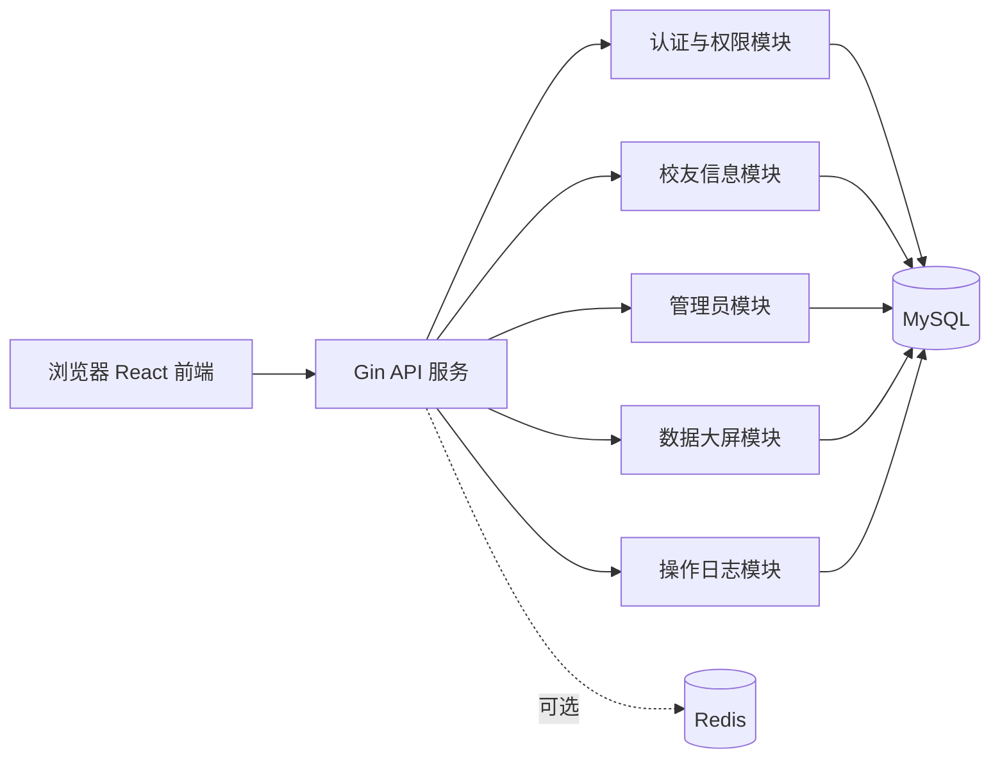
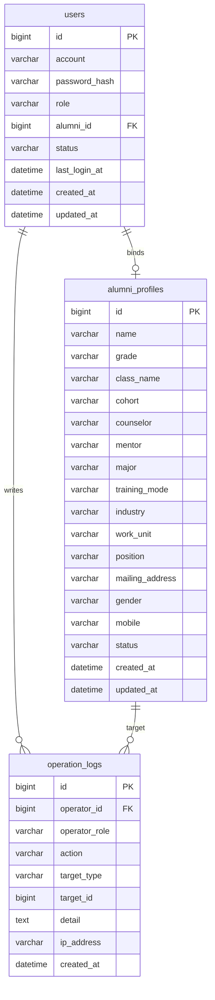
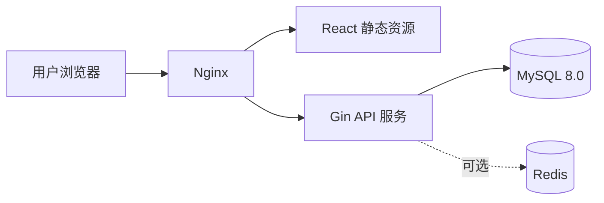

# 山大政管学院校友平台一期技术方案文档（MPA 试点）

版本：V0.1  
日期：2026-04-27  
对应需求文档：`山大政管学院校友平台一期需求文档-MPA试点.md`  
技术栈：Golang、Gin、GORM、React、MySQL，可选 Redis

## 1. 需求分析

### 1.1 建设目标

第一阶段建设目标是完成一个面向 MPA 校友试点的数据管理与查询平台，支持管理员维护校友数据、查看数据大屏，支持普通校友登录后查看所有校友信息并维护自己的资料，支持超级管理员管理管理员账号。

一期不做全院扩展、不做活动报名、不做内容管理、不做 AI 功能。架构和数据模型需为后续扩展到政管学院全量校友保留空间。

### 1.2 用户角色

| 角色 | 说明 | 核心权限 |
| --- | --- | --- |
| 游客 | 未登录用户 | 仅可访问登录页和公开首页，不能访问校友服务 |
| 校友 | 登录后的 MPA 校友 | 查看所有校友信息，维护本人信息 |
| 管理员 | 校友数据运营人员 | 管理校友信息，查看数据大屏 |
| 超级管理员 | 平台最高权限用户 | 拥有管理员权限，并可创建、删除管理员 |

### 1.3 功能性需求

#### 1.3.1 登录与权限

1. 用户通过账号密码登录。
2. 系统根据账号角色识别用户权限。
3. 未登录用户访问受限资源时返回未登录状态或跳转登录页。
4. 无权限用户访问后台、数据大屏、管理员管理接口时返回无权限错误。
5. 登录用户可修改自己的密码。
6. 超级管理员可创建、删除管理员账号。

#### 1.3.2 校友端

1. 校友登录后可查看校友列表。
2. 校友可按姓名、年级、班级、届数、导师、专业、培养方式、行业、工作单位、职务等条件搜索。
3. 校友可查看校友详情。
4. 校友可查看并维护自己的个人信息。
5. 校友不能新增、删除、编辑他人校友信息。

#### 1.3.3 管理端

1. 管理员可查看校友列表和详情。
2. 管理员可新增、编辑、删除校友信息。
3. 管理员可维护校友账号与校友档案的绑定关系。
4. 管理员可查看数据大屏。
5. 管理员不可创建、删除管理员账号。

#### 1.3.4 数据大屏

数据大屏面向管理员和超级管理员，展示 MPA 校友统计信息：

1. 校友总数。
2. 已开通账号数。
3. 年级分布。
4. 班级分布。
5. 届数分布。
6. 性别分布。
7. 专业分布。
8. 培养方式分布。
9. 行业分布。
10. 资料完整率，如手机号、工作单位、导师、职务完整率。

#### 1.3.5 可选功能

第一阶段可根据时间决定是否实现：

1. Excel 批量导入校友数据。
2. 校友数据导出。
3. 管理员账号停用。
4. 软删除恢复。

### 1.4 非功能性需求

| 类别 | 要求 |
| --- | --- |
| 性能 | 校友列表分页查询 2 秒内返回；大屏统计 3 秒内返回 |
| 安全 | 密码哈希存储；服务端强制权限校验；游客不能通过接口获取校友数据 |
| 可用性 | 管理端支持桌面浏览器；校友端兼容移动端浏览 |
| 可维护性 | 后端分层清晰，接口、业务、数据访问分离 |
| 可扩展性 | 数据模型支持后续扩展学院、专业、项目、活动等模块 |
| 审计 | 管理员新增、修改、删除校友和管理员账号需记录操作日志 |
| 备份 | MySQL 数据需支持定期备份和恢复 |

### 1.5 系统边界

一期系统边界如下：

| 范围 | 是否纳入一期 |
| --- | --- |
| MPA 校友信息管理 | 纳入 |
| 校友登录与信息查询 | 纳入 |
| 管理员后台 | 纳入 |
| 数据大屏 | 纳入 |
| 超级管理员管理管理员 | 纳入 |
| 全院校友扩展 | 不纳入 |
| AI 找校友、AI 校友卡 | 不纳入 |
| 活动报名、签到 | 不纳入 |
| 新闻通知内容管理 | 不纳入 |
| 支付、订单、商品 | 不涉及 |

### 1.6 核心业务流程

#### 1.6.1 登录流程

1. 用户输入账号和密码。
2. 后端校验账号是否存在、状态是否正常。
3. 后端使用密码哈希算法校验密码。
4. 登录成功后生成会话凭证。
5. 前端根据角色跳转校友端或管理端。

#### 1.6.2 校友查看校友信息流程

1. 校友登录。
2. 前端请求校友列表接口。
3. 后端校验用户角色为校友及以上。
4. 后端按查询条件分页返回校友数据。
5. 校友进入详情页查看完整资料。

#### 1.6.3 校友维护本人信息流程

1. 校友进入“我的资料”页面。
2. 系统读取当前登录用户关联的校友档案。
3. 校友修改允许维护的字段。
4. 后端校验当前用户只能修改自己的档案。
5. 保存变更并记录更新时间、更新人。

#### 1.6.4 管理员维护校友信息流程

1. 管理员进入校友管理页。
2. 管理员新增、编辑或删除校友信息。
3. 后端校验管理员权限。
4. 写入校友表。
5. 记录操作日志。
6. 数据大屏统计随最新数据更新。

#### 1.6.5 超级管理员创建管理员流程

1. 超级管理员进入管理员管理页。
2. 填写管理员账号、姓名、初始密码。
3. 后端校验超级管理员权限。
4. 创建管理员账号。
5. 记录操作日志。

## 2. 数据库选型

### 2.1 候选方案对比

| 类型 | 方案 | 优点 | 缺点 | 适用性 |
| --- | --- | --- | --- | --- |
| 关系型数据库 | MySQL | 成熟稳定、团队熟悉度高、GORM 支持完善、适合结构化校友数据 | 复杂全文检索能力一般 | 适合作为主库 |
| 关系型数据库 | PostgreSQL | SQL 能力强、JSON/全文检索能力好 | 运维和团队熟悉度可能低于 MySQL | 可选，但一期非必要 |
| NoSQL | MongoDB | 文档结构灵活 | 权限、关联、统计和事务管理复杂度更高 | 不适合作为一期主库 |
| 缓存数据库 | Redis | 高性能缓存、会话、限流、热点统计 | 需要额外运维 | 可选引入 |

### 2.2 主数据库选型

一期主数据库选择 MySQL 8.0。

选型理由：

1. 校友、用户、角色、日志等数据结构明确，适合关系型数据库。
2. MySQL 与 Golang、GORM 生态兼容良好。
3. 当前项目已有 MySQL 数据基础，迁移成本低。
4. 后续支持读写分离、备份恢复、索引优化和数据迁移。

### 2.3 Redis 使用策略

Redis 不是一期强依赖，但建议预留配置。

可用于：

1. 登录会话存储。
2. 登录失败次数限制。
3. 短时间缓存数据大屏统计结果。
4. 缓存高频字典项，如年级、专业、培养方式。
5. 后续扩展验证码、消息通知、异步任务状态。

一期建议：

1. 若部署资源有限，可先不启用 Redis，认证使用短时 JWT 或数据库会话。
2. 若要求会话可控、可踢下线、可限流，建议一期启用 Redis。

### 2.4 数据备份与恢复

1. MySQL 每日定时全量备份。
2. 重要操作前手动备份，如批量导入前。
3. 备份文件保留至少 30 天。
4. 管理员删除校友建议使用软删除，降低误删恢复成本。
5. 数据库迁移使用版本化 SQL 或迁移工具管理。

## 3. 框架选型

### 3.1 后端技术栈

| 技术 | 选型 | 说明 |
| --- | --- | --- |
| 编程语言 | Golang | 性能稳定，部署简单，适合 API 服务 |
| Web 框架 | Gin | 轻量、高性能、生态成熟 |
| ORM | GORM | 与 MySQL 适配成熟，支持模型、关联、事务、迁移 |
| 配置管理 | Viper 或环境变量 | 管理数据库、Redis、JWT、日志等配置 |
| 日志 | zap 或 zerolog | 结构化日志，便于排查问题 |
| 参数校验 | go-playground/validator | 与 Gin 绑定能力兼容 |
| 密码哈希 | bcrypt 或 argon2id | 不使用明文或普通 SHA |
| API 文档 | Swagger/OpenAPI | 便于前后端联调 |

后端建议采用分层结构：

```text
api handler -> service -> repository -> model -> database
```

### 3.2 前端技术栈

| 技术 | 选型 | 说明 |
| --- | --- | --- |
| 框架 | React | 组件化开发，适合后台和校友端 |
| 构建工具 | Vite | 启动快，配置轻量 |
| 路由 | React Router | 页面路由和权限路由 |
| 状态管理 | Zustand 或 Redux Toolkit | 一期状态较简单，建议 Zustand |
| 请求库 | Axios | 统一封装请求、错误处理、登录过期处理 |
| UI 组件库 | Ant Design | 管理后台表格、表单、分页、弹窗效率高 |
| 图表库 | ECharts | 数据大屏、统计图表 |

### 3.3 前后端通信

1. 前端 React 通过 RESTful API 调用 Gin 后端。
2. 统一使用 JSON 请求和响应。
3. 登录凭证建议放在 HttpOnly Cookie 中，降低 XSS 窃取风险。
4. 所有后台接口由后端中间件校验角色权限。

### 3.4 是否采用微服务

一期不采用微服务，采用单体后端服务。

理由：

1. 一期模块数量有限，用户规模可控。
2. 单体架构开发、部署、调试和运维成本低。
3. Gin 单体服务足以支撑当前登录、校友管理、数据大屏需求。
4. 后续可按模块拆分，如认证服务、校友服务、统计服务。

## 4. 模块设计

### 4.1 系统整体架构



### 4.2 后端模块划分

| 模块 | 职责 |
| --- | --- |
| 认证模块 | 登录、退出、当前用户、修改密码、会话校验 |
| 权限模块 | 基于角色的接口权限控制 |
| 校友模块 | 校友列表、详情、本人资料维护、管理员增删改查 |
| 管理员模块 | 超级管理员创建、删除管理员 |
| 数据大屏模块 | 统计总览、年级分布、班级分布、专业分布等 |
| 字典模块 | 年级、专业、培养方式、行业等枚举管理，可先内置 |
| 日志模块 | 记录管理员和超级管理员关键操作 |
| 导入导出模块 | 可选，实现 Excel 导入导出 |

### 4.3 前端模块划分

| 模块 | 页面 |
| --- | --- |
| 公共模块 | 登录页、无权限页、404 页、布局组件 |
| 校友端 | 用户中心、校友列表、校友详情、我的资料、修改密码 |
| 管理端 | 管理后台首页、校友管理、数据大屏、管理员管理 |
| 公共组件 | 表格、搜索表单、详情面板、权限路由、图表组件 |

### 4.4 目录结构建议

#### 后端目录

```text
server/
  cmd/
    api/
      main.go
  internal/
    config/
    middleware/
    model/
    repository/
    service/
    handler/
    router/
    response/
    validator/
  migrations/
  pkg/
  go.mod
```

#### 前端目录

```text
web/
  src/
    api/
    components/
    layouts/
    pages/
      login/
      alumni/
      admin/
      dashboard/
      profile/
    router/
    store/
    utils/
  package.json
  vite.config.ts
```

### 4.5 权限控制设计

后端统一使用中间件控制权限。

角色定义：

```text
guest < alumni < admin < super_admin
```

权限规则：

1. 游客不进入 API 受限资源。
2. 校友可访问校友查询和本人资料接口。
3. 管理员可访问校友管理和数据大屏接口。
4. 超级管理员可访问管理员管理接口。
5. 权限判断必须在服务端完成，前端只做展示控制。

## 5. 数据库设计

### 5.1 概念模型



### 5.2 表结构设计

#### 5.2.1 用户表 `users`

```sql
CREATE TABLE users (
  id BIGINT UNSIGNED PRIMARY KEY AUTO_INCREMENT,
  account VARCHAR(100) NOT NULL UNIQUE COMMENT '登录账号',
  password_hash VARCHAR(255) NOT NULL COMMENT '密码哈希',
  role VARCHAR(32) NOT NULL COMMENT '角色：alumni/admin/super_admin',
  alumni_id BIGINT UNSIGNED NULL COMMENT '关联校友ID',
  real_name VARCHAR(100) NULL COMMENT '用户姓名',
  mobile VARCHAR(30) NULL COMMENT '管理员手机号或备用联系方式',
  status VARCHAR(32) NOT NULL DEFAULT 'active' COMMENT 'active/disabled/deleted',
  last_login_at DATETIME NULL COMMENT '最近登录时间',
  created_at DATETIME NOT NULL DEFAULT CURRENT_TIMESTAMP,
  updated_at DATETIME NOT NULL DEFAULT CURRENT_TIMESTAMP ON UPDATE CURRENT_TIMESTAMP,
  deleted_at DATETIME NULL,
  INDEX idx_users_role (role),
  INDEX idx_users_alumni_id (alumni_id),
  INDEX idx_users_status (status)
) ENGINE=InnoDB DEFAULT CHARSET=utf8mb4 COMMENT='用户账号表';
```

约束说明：

1. `account` 唯一。
2. 校友账号必须绑定 `alumni_id`。
3. 管理员和超级管理员可以不绑定 `alumni_id`。
4. `role` 建议在代码层使用枚举校验。

#### 5.2.2 校友档案表 `alumni_profiles`

```sql
CREATE TABLE alumni_profiles (
  id BIGINT UNSIGNED PRIMARY KEY AUTO_INCREMENT,
  name VARCHAR(100) NOT NULL COMMENT '姓名',
  grade VARCHAR(50) NOT NULL COMMENT '年级',
  class_name VARCHAR(100) NULL COMMENT '班级',
  cohort VARCHAR(50) NULL COMMENT '届数',
  counselor VARCHAR(100) NULL COMMENT '辅导员',
  mentor VARCHAR(100) NULL COMMENT '导师',
  major VARCHAR(100) NULL COMMENT '专业',
  training_mode VARCHAR(50) NULL COMMENT '培养方式',
  industry VARCHAR(100) NULL COMMENT '行业',
  work_unit VARCHAR(255) NULL COMMENT '工作单位',
  position VARCHAR(100) NULL COMMENT '职务',
  mailing_address VARCHAR(255) NULL COMMENT '通讯地址',
  gender VARCHAR(20) NULL COMMENT '性别',
  mobile VARCHAR(30) NULL COMMENT '联系方式（手机）',
  remark TEXT NULL COMMENT '管理员备注',
  status VARCHAR(32) NOT NULL DEFAULT 'active' COMMENT 'active/deleted',
  created_by BIGINT UNSIGNED NULL COMMENT '创建人用户ID',
  updated_by BIGINT UNSIGNED NULL COMMENT '更新人用户ID',
  created_at DATETIME NOT NULL DEFAULT CURRENT_TIMESTAMP,
  updated_at DATETIME NOT NULL DEFAULT CURRENT_TIMESTAMP ON UPDATE CURRENT_TIMESTAMP,
  deleted_at DATETIME NULL,
  INDEX idx_alumni_name (name),
  INDEX idx_alumni_grade (grade),
  INDEX idx_alumni_class_name (class_name),
  INDEX idx_alumni_cohort (cohort),
  INDEX idx_alumni_major (major),
  INDEX idx_alumni_training_mode (training_mode),
  INDEX idx_alumni_industry (industry),
  INDEX idx_alumni_mobile (mobile),
  INDEX idx_alumni_status (status),
  FULLTEXT KEY ft_alumni_search (name, work_unit, position, mentor, counselor)
) ENGINE=InnoDB DEFAULT CHARSET=utf8mb4 COMMENT='校友档案表';
```

说明：

1. MySQL 8.0 支持 InnoDB FULLTEXT，但中文分词效果有限。若中文全文检索要求较高，后续可引入 Elasticsearch 或 Meilisearch。
2. 一期普通筛选可优先使用 `LIKE` + 索引字段组合。
3. 删除建议使用 `status = deleted` + `deleted_at` 软删除。

#### 5.2.3 操作日志表 `operation_logs`

```sql
CREATE TABLE operation_logs (
  id BIGINT UNSIGNED PRIMARY KEY AUTO_INCREMENT,
  operator_id BIGINT UNSIGNED NOT NULL COMMENT '操作人用户ID',
  operator_role VARCHAR(32) NOT NULL COMMENT '操作人角色',
  action VARCHAR(100) NOT NULL COMMENT '操作类型',
  target_type VARCHAR(100) NOT NULL COMMENT '操作对象类型',
  target_id BIGINT UNSIGNED NULL COMMENT '操作对象ID',
  detail JSON NULL COMMENT '操作详情',
  ip_address VARCHAR(64) NULL COMMENT 'IP地址',
  user_agent VARCHAR(512) NULL COMMENT '浏览器UA',
  created_at DATETIME NOT NULL DEFAULT CURRENT_TIMESTAMP,
  INDEX idx_logs_operator_id (operator_id),
  INDEX idx_logs_action (action),
  INDEX idx_logs_target (target_type, target_id),
  INDEX idx_logs_created_at (created_at)
) ENGINE=InnoDB DEFAULT CHARSET=utf8mb4 COMMENT='操作日志表';
```

### 5.3 字典设计

一期可先在代码中维护枚举，后续再拆成字典表。

建议枚举：

| 字段 | 值 |
| --- | --- |
| 角色 | `alumni`、`admin`、`super_admin` |
| 用户状态 | `active`、`disabled`、`deleted` |
| 校友状态 | `active`、`deleted` |
| 性别 | `男`、`女`、`未填` |
| 培养方式 | `全日制`、`非全日制`、`定向`、`其他` |
| 行业 | `党政机关`、`事业单位`、`国有企业`、`民营企业`、`高校科研`、`金融`、`医疗卫生`、`社会组织`、`其他` |

### 5.4 索引策略

1. 高频筛选字段建立普通索引：年级、班级、届数、专业、培养方式、行业。
2. 手机号建立索引，用于唯一性排查和管理员查询。
3. 操作日志按操作人、对象、创建时间建立索引。
4. 校友列表默认按 `id DESC` 或 `updated_at DESC` 分页，避免无索引排序。
5. 数据量较小时不做过度索引；后续根据慢查询日志优化。

### 5.5 外键策略

一期建议不强制使用数据库外键，采用应用层约束。

理由：

1. 后续导入历史数据时更灵活。
2. 软删除场景下数据库外键处理复杂。
3. GORM 和服务层可保证关联校验。

但必须在业务代码中校验：

1. 校友账号绑定的 `alumni_id` 必须存在。
2. 删除校友时需处理绑定账号状态。
3. 删除管理员时需检查不能删除自己、不能删除最后一个超级管理员。

## 6. 接口设计

### 6.1 API 规范

统一前缀：

```text
/api/v1
```

统一响应格式：

```json
{
  "code": 0,
  "message": "success",
  "data": {}
}
```

分页响应格式：

```json
{
  "code": 0,
  "message": "success",
  "data": {
    "items": [],
    "page": 1,
    "page_size": 20,
    "total": 100
  }
}
```

错误码建议：

| code | 含义 |
| --- | --- |
| 0 | 成功 |
| 400 | 参数错误 |
| 401 | 未登录 |
| 403 | 无权限 |
| 404 | 资源不存在 |
| 409 | 数据冲突，如账号重复 |
| 500 | 服务端错误 |

### 6.2 认证接口

#### 6.2.1 登录

```http
POST /api/v1/auth/login
```

请求：

```json
{
  "account": "admin",
  "password": "password"
}
```

响应：

```json
{
  "code": 0,
  "message": "success",
  "data": {
    "user": {
      "id": 1,
      "account": "admin",
      "role": "super_admin",
      "real_name": "系统管理员"
    }
  }
}
```

#### 6.2.2 当前用户

```http
GET /api/v1/auth/me
```

权限：登录用户。

#### 6.2.3 退出

```http
POST /api/v1/auth/logout
```

权限：登录用户。

#### 6.2.4 修改密码

```http
POST /api/v1/auth/change-password
```

请求：

```json
{
  "old_password": "old",
  "new_password": "new",
  "confirm_password": "new"
}
```

### 6.3 校友接口

#### 6.3.1 校友列表

```http
GET /api/v1/alumni?page=1&page_size=20&keyword=&grade=&class_name=&cohort=&major=&training_mode=&industry=
```

权限：校友、管理员、超级管理员。

响应字段：

```json
{
  "items": [
    {
      "id": 1,
      "name": "张三",
      "grade": "2020级",
      "class_name": "2020级MPA周末班",
      "cohort": "2023届",
      "major": "公共管理",
      "training_mode": "非全日制",
      "industry": "党政机关",
      "work_unit": "某某单位",
      "position": "科长",
      "mobile": "13800000000"
    }
  ],
  "page": 1,
  "page_size": 20,
  "total": 1
}
```

#### 6.3.2 校友详情

```http
GET /api/v1/alumni/{id}
```

权限：校友、管理员、超级管理员。

#### 6.3.3 我的资料

```http
GET /api/v1/alumni/me
PUT /api/v1/alumni/me
```

权限：校友。

校友可编辑字段建议：

1. `work_unit`
2. `position`
3. `mailing_address`
4. `mobile`

如允许校友修改更多字段，应在需求确认后调整接口校验规则。

### 6.4 管理端校友接口

#### 6.4.1 新增校友

```http
POST /api/v1/admin/alumni
```

权限：管理员、超级管理员。

#### 6.4.2 编辑校友

```http
PUT /api/v1/admin/alumni/{id}
```

权限：管理员、超级管理员。

#### 6.4.3 删除校友

```http
DELETE /api/v1/admin/alumni/{id}
```

权限：管理员、超级管理员。

实现建议：软删除。

### 6.5 数据大屏接口

#### 6.5.1 总览

```http
GET /api/v1/admin/dashboard/overview
```

响应：

```json
{
  "code": 0,
  "message": "success",
  "data": {
    "total_alumni": 3200,
    "total_accounts": 1200,
    "mobile_complete_rate": 0.92,
    "work_unit_complete_rate": 0.86,
    "mentor_complete_rate": 0.65
  }
}
```

#### 6.5.2 分布统计

```http
GET /api/v1/admin/dashboard/distribution?dimension=grade
```

`dimension` 可选：

1. `grade`
2. `class_name`
3. `cohort`
4. `gender`
5. `major`
6. `training_mode`
7. `industry`

响应：

```json
{
  "code": 0,
  "message": "success",
  "data": [
    {
      "name": "2020级",
      "value": 120
    }
  ]
}
```

### 6.6 超级管理员接口

#### 6.6.1 管理员列表

```http
GET /api/v1/super-admin/admins?page=1&page_size=20
```

权限：超级管理员。

#### 6.6.2 创建管理员

```http
POST /api/v1/super-admin/admins
```

请求：

```json
{
  "account": "manager01",
  "password": "InitPass123",
  "real_name": "管理员01",
  "mobile": "13800000000"
}
```

#### 6.6.3 删除管理员

```http
DELETE /api/v1/super-admin/admins/{id}
```

约束：

1. 不能删除自己。
2. 不能删除超级管理员账号。
3. 删除管理员建议设置 `status = deleted`。

### 6.7 接口安全认证

推荐方案：

1. 登录成功后通过 HttpOnly Cookie 写入会话或访问令牌。
2. 后端中间件解析登录态。
3. 后端中间件校验角色权限。
4. 敏感操作要求 CSRF 防护，若前后端同域部署，可使用 SameSite Cookie。
5. 管理端接口必须校验 `admin` 或 `super_admin`。
6. 超级管理员接口必须校验 `super_admin`。

## 7. 开发计划

### 7.1 迭代计划

#### 第 1 阶段：项目基础搭建

交付内容：

1. Go + Gin 后端工程初始化。
2. React + Vite 前端工程初始化。
3. MySQL 数据库初始化脚本。
4. 配置管理、日志、统一响应、错误处理。
5. 基础部署说明。

预计工作量：3-5 个工作日。

#### 第 2 阶段：认证与权限

交付内容：

1. 用户表和初始超级管理员。
2. 登录、退出、当前用户、修改密码接口。
3. 角色权限中间件。
4. 前端登录页、权限路由、基础布局。

预计工作量：4-6 个工作日。

#### 第 3 阶段：校友信息管理

交付内容：

1. 校友表结构。
2. 校友列表、详情接口。
3. 管理员新增、编辑、删除校友接口。
4. 校友本人资料查看和修改接口。
5. 前端校友列表、详情、我的资料、管理端校友管理页。

预计工作量：7-10 个工作日。

#### 第 4 阶段：数据大屏

交付内容：

1. 统计总览接口。
2. 年级、班级、届数、性别、专业、培养方式、行业分布接口。
3. 前端数据大屏页面。
4. 图表联动和筛选跳转。

预计工作量：4-6 个工作日。

#### 第 5 阶段：超级管理员功能

交付内容：

1. 管理员列表接口。
2. 创建管理员接口。
3. 删除管理员接口。
4. 前端管理员管理页面。
5. 操作日志记录。

预计工作量：3-5 个工作日。

#### 第 6 阶段：测试、修复与上线准备

交付内容：

1. 接口测试。
2. 权限测试。
3. 前端功能测试。
4. 数据库备份恢复验证。
5. 部署文档和验收清单。

预计工作量：4-6 个工作日。

### 7.2 交付物

| 阶段 | 交付物 |
| --- | --- |
| 基础搭建 | 后端工程、前端工程、数据库初始化脚本 |
| 认证权限 | 登录接口、权限中间件、登录页、权限路由 |
| 校友管理 | 校友 CRUD、校友查询、本人资料维护 |
| 数据大屏 | 统计接口、图表页面 |
| 超级管理员 | 管理员账号管理 |
| 上线准备 | 测试报告、部署文档、备份方案 |

### 7.3 人员分工建议

| 角色 | 职责 |
| --- | --- |
| 后端开发 | Gin API、GORM 模型、权限中间件、数据库设计 |
| 前端开发 | React 页面、权限路由、表格表单、图表 |
| 产品/需求负责人 | 字段口径、权限规则、验收标准确认 |
| 测试 | 功能测试、权限测试、数据校验测试 |
| 运维/部署 | MySQL、服务部署、备份、日志 |

### 7.4 风险评估

| 风险 | 影响 | 应对 |
| --- | --- | --- |
| 校友字段口径未定 | 影响数据库和页面设计 | 开发前冻结一期字段和枚举 |
| 普通校友是否可见完整手机号未定 | 影响隐私和接口输出 | 先设计脱敏能力，按配置控制展示 |
| 历史数据质量不一致 | 影响搜索和统计 | 导入前做数据清洗和错误报告 |
| 权限控制只做前端判断 | 存在数据泄露风险 | 后端必须统一权限中间件 |
| 删除误操作 | 数据丢失 | 默认软删除，保留恢复能力 |
| 大屏统计慢 | 用户体验差 | 优化索引，必要时 Redis 缓存统计结果 |

### 7.5 测试计划

#### 功能测试

1. 游客访问受限页面。
2. 校友登录、查询校友、查看详情、修改本人信息。
3. 管理员新增、编辑、删除校友。
4. 管理员查看数据大屏。
5. 超级管理员创建、删除管理员。

#### 权限测试

1. 游客不能调用校友列表接口。
2. 校友不能调用管理员接口。
3. 管理员不能调用超级管理员接口。
4. 超级管理员不能删除自己。
5. 系统不能删除最后一个超级管理员。

#### 数据测试

1. 手机号格式校验。
2. 必填字段校验。
3. 分页查询正确性。
4. 搜索条件组合正确性。
5. 大屏统计与数据库实际数据一致。

#### 安全测试

1. 密码错误提示不暴露账号是否存在。
2. 密码不明文存储。
3. 未登录 API 返回 401。
4. 无权限 API 返回 403。
5. 删除、修改等关键操作有日志。

## 8. 部署建议

一期建议采用单机或轻量服务器部署：



部署要点：

1. Nginx 统一处理 HTTPS、静态资源和 API 反向代理。
2. Go API 使用 systemd、Docker 或进程管理工具部署。
3. MySQL 定期备份。
4. 生产配置使用环境变量，不写入代码仓库。
5. 日志按日期切分，至少保留 30 天。

## 9. 待确认技术问题

1. 是否一期启用 Redis，还是先使用 MySQL + JWT/Session 完成认证？
2. 普通校友查看手机号是否展示完整号码，还是脱敏展示？
3. 校友本人可修改字段范围是否限定为联系方式、单位、职务、通讯地址？
4. 一期是否必须做 Excel 导入导出？
5. 超级管理员是否允许创建新的超级管理员？
6. 生产部署方式是传统服务器部署，还是 Docker 部署？
7. 是否需要保留旧 Flask/MySQL 数据并迁移到新 Go 服务？

